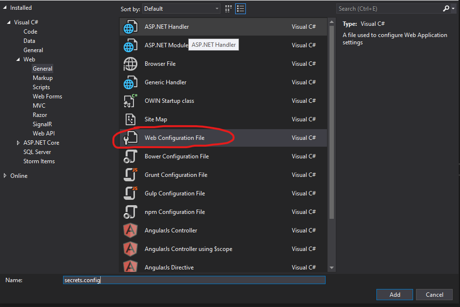

# Implementing A **Secret Connection String** in the General Store API Project

[Jump to Integration with Existing Project](#integrate-with-your-existing-project)

## To Implement With A Clone Of this Repo:

1. Clone this repository to your local machine.

2. Open the solution in Visual Studio.

3. Create a `secrets.config` file at the solution-level directory by right-clicking the WebAPI assembly, selecting `Add > New Item`, and choosing **Web configuration File** from the list of options:



4. Open the newly created `secrets.config` file. Remove all code inside except for the XML header on the top line (`<?xml version="1.0"?>`).

5. Create a `<connectionStrings>` section inside the `secrets.config` file, containing the connection string configuration for your application. If you are using Docker, it may look something like this:

```xml
<connectionStrings>
	<add name="DefaultConnection" connectionString="Data Source=localhost;Initial Catalog=GeneralStoreDb_Docker;User ID=sa;Password=[YOUR_PASSWORD_GOES_HERE]" providerName="System.Data.SqlClient" />
</connectionStrings>
```

6. In your `.gitignore` file, include `secrets.config` under the **User-specific files** heading.


7. Run your application. Confirm it runs as it should.

8. Push to github. Confirm your `secrets.config` file is not present in the remote repository.

---

## Integrate With Your Existing Project:

1. Create a `secrets.config` file at the solution-level directory by right-clicking the WebAPI assembly, selecting `Add > New Item`, and choosing **Web configuration File** from the list of options:


2. Open the newly created `secrets.config` file. Remove all code inside except for the XML header on the top line (`<?xml version="1.0"?>`).

3. Open your `Web.config` file and navigate to the `<connectionStrings>` section. If you are using Docker, it may look something like this:

```xml
<connectionStrings>
	<add name="DefaultConnection" connectionString="Data Source=localhost;Initial Catalog=GeneralStoreDb_Docker;User ID=sa;Password=[YOUR_PASSWORD_GOES_HERE]" providerName="System.Data.SqlClient" />
</connectionStrings>
```

4. Copy your existing `<connectionStrings>` section to the clipboard.

5. Go back to your `secrets.config` file, and paste the `<connectionStrings>` section into it, just below the XML header. When you're done, this should be the only code in the file.

```xml
<?xml version="1.0"?>

<connectionStrings>
	<add name="DefaultConnection" connectionString="Data Source=localhost;Initial Catalog=GeneralStoreDb_Docker;User ID=sa;Password=[YOUR_PASSWORD_GOES_HERE]" providerName="System.Data.SqlClient" />
</connectionStrings>
```

6. Go back to your `Web.config` file, and comment out your existing connection string.

```xml
	<appSettings>
	</appSettings>
<!--<connectionStrings>
	<add name="DefaultConnection" connectionString="Data Source=localhost;Initial Catalog=GeneralStoreDb_Docker;User ID=sa;Password=[YOUR_PASSWORD_GOES_HERE]" providerName="System.Data.SqlClient" />
</connectionStrings>-->
	<system.web>
```

7. Create a new `<connectionStrings>` section and set the `configSource` attribute to your `secrets.config` file, like this:

```xml
	<connectionStrings configSource="secrets.config"></connectionStrings>
```

8. **Ensure that the old connection string is commented out, and that it has been correctly copied into the `secrets.config` file!** Then you may close both `Web.config` and `secrets.config`.

9. In your `.gitignore` file, include `secrets.config` under the **User-specific files** heading.


10. Run your application. Confirm it runs as it should.

11. Push to github. Confirm your `secrets.config` file is not present in the remote repository.

## **Done!**
